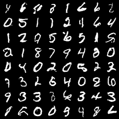
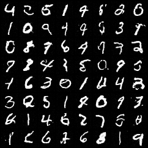
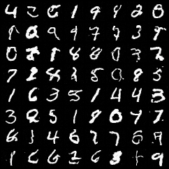
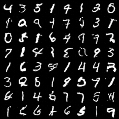
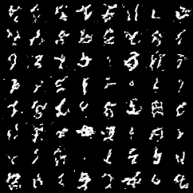
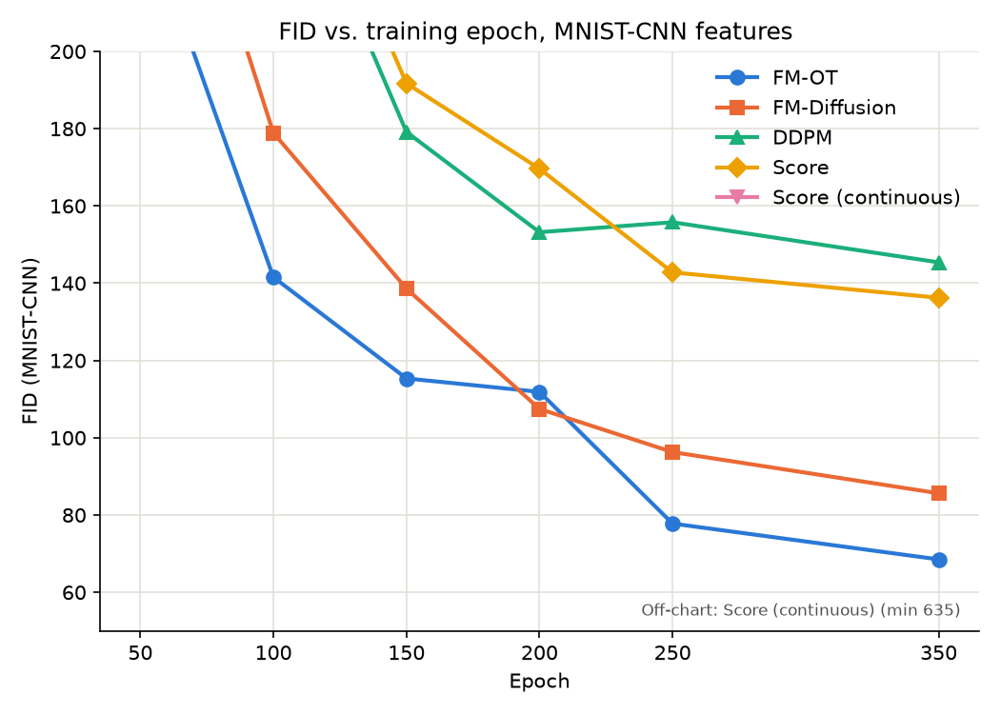
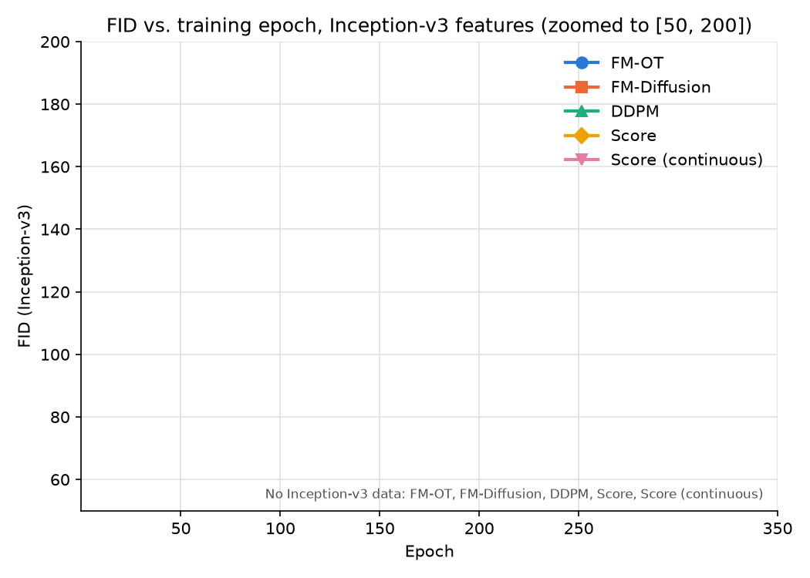

# MNIST Generative Modeling

Five generative-modeling methods — two flow-matching variants, DDPM, and two
score-matching variants — implemented on a shared UNet, a shared
continuous-time convention, and a shared probability-flow-ODE sampler, so
they can be trained and compared on equal footing.


| FM-OT samples | FM-Diffusion samples | DDPM samples | Score-matching samples | Score-continuous samples
|---|---|---|---|---|
|  |  |  |  | |

## Overview

All five methods share the same forward corruption recipe: a clean digit
`x0` and Gaussian noise `x1 ~ N(0, I)` are mixed along a conditional path
`x_t = alpha(t) * x0 + sigma(t) * x1` for `t` in `[T_MIN, 1]`. What differs
per method is (a) which path — linear/OT or variance-preserving (VP) — (b)
what the network head regresses (velocity, noise, or score), and (c) the
loss weighting. Every method exposes a `velocity(x, t)` method (the
probability-flow-ODE drift `dx/dt`), which is the only thing the sampler
touches — so one integrator draws samples from all five identically.

| Method | Family | Conditional path | Network predicts | Loss weight |
|---|---|---|---|---|
| `fm_ot` | Flow matching | Linear / optimal transport | velocity | uniform |
| `fm_diffusion` | Flow matching | Variance-preserving (VP) | velocity | uniform |
| `ddpm` | Noise matching | VP | noise `ε` | uniform (Ho et al. 2020) |
| `score` | Score matching | VP | score | `sigma(t)^2` (Song & Ermon 2019) |
| `score_continuous` | Score matching | VP | score | `beta(1-t)` (likelihood-weighted) |

> [!NOTE]
> `src/methods/base.py` defines the shared `Method` interface; `src/schedules.py`
> is the single source of truth for `alpha(t)`, `sigma(t)`, and `beta(t)`.

## Evaluation

Each trained checkpoint is scored on three metrics
(`src/evaluate_metrics.py`), matching the protocol in Song et al. 2021:

- **NLL (bits/dim)** — exact likelihood via the augmented probability-flow
  ODE `(x, log-det)` with a Hutchinson trace estimator (the FFJORD trick),
  evaluated on held-out test data.
- **FID** — Frechet distance between real and generated feature
  statistics. Two feature extractors are supported: ImageNet-pretrained
  Inception-v3 (`--feature-extractor inception`, default, comparable to
  numbers reported elsewhere) and a small CNN trained on MNIST itself
  (`--feature-extractor mnist_cnn`, more domain-appropriate for 28x28
  grayscale digits — train it first with `src/train_classifier.py`).
- **NFE** — average number of function evaluations an adaptive-tolerance
  (`dopri5`) solver needs to draw one sample.

The two extractors live in different, non-comparable feature spaces, so
every report filename is namespaced by extractor (`src/utils/metrics_paths.py`
-- e.g. `metrics.json` vs. `metrics_mnist_cnn.json`, `inception` kept
unsuffixed for backward compatibility). `src/compare_methods.py
--feature-extractor {inception,mnist_cnn}` collects every method's report
into one Markdown table, and `src/utils/plot_metrics.py` plots FID against
training epoch from the same per-extractor history files.

## Getting started

```bash
conda env create -f environment.yml
conda activate flow
pip install python-dotenv   # not yet in environment.yml, but required
cp .env.example .env        # then set CKPT_ROOT to a writable directory
```

`CKPT_ROOT` is where every script reads and writes checkpoints, cached FID
statistics, and metrics reports (one subdirectory per method — see
`.env.example`).

## Usage

```bash
# Train one of: fm_ot, fm_diffusion, ddpm, score, score_continuous
bash scripts/train_ddpm.sh --epochs 100

# Train the MNIST-CNN classifier used by --feature-extractor mnist_cnn
bash scripts/train_classifier.sh --epochs 10

# Draw samples from the latest checkpoint (pass --ckpt for a specific one)
python -m src.sampling --method ddpm --num-samples 64 --out samples_ddpm.png

# Evaluate NLL / FID / NFE for one method
bash scripts/evaluate.sh ddpm --feature-extractor mnist_cnn

# Evaluate and compare all 5 methods, then render comparison.md
bash scripts/compare_all.sh --feature-extractor mnist_cnn

# Plot FID vs. epoch for all 5 methods, zoomed to a Y range you choose
python -m src.utils.plot_metrics --feature-extractor mnist_cnn --ylim 50 200
```

> [!TIP]
> `--epochs 50 80 100` on `evaluate.sh` evaluates specific checkpoints and
> merges them into a `metrics_history.json` you can plot FID/NLL against
> epoch with -- re-running with a different `--epochs` subset later adds
> to that history instead of overwriting it.

## Results

Example run, epoch 350, 2000 samples per metric — small by FID convention
(Heusel et al. 2017 use tens of thousands), so treat these as directional
rather than final. The two tables are separate feature spaces (see
[Evaluation](#evaluation)) and their FID columns are **not** comparable to
each other.

<div style="display: flex; gap: 30px;">

<div style="flex: 1;">

### MNIST-CNN

| Method | NLL (BPD) ↓ | FID ↓ | Avg. NFE ↓ |
|---|---:|---:|---:|
| `ddpm` | 2.390 | 145.403 | 176.0 |
| `score` | 1.869 | 136.238 | 150.5 |
| `score_continuous` | 2.370 | 1248.002 | 180.5 |
| `fm_diffusion` | 2.221 | 85.628 | 155.0 |
| `fm_ot` | **1.607** | **68.515** | **114.5** |


</div>

<div style="flex: 1;">

### InceptionV3

| Method | NLL (BPD) ↓ | FID ↓ | Avg. NFE ↓ |
|---|---:|---:|---:|
| `ddpm` | 2.392 | 124.481 | 177.5 |
| `score` | 1.868 | 129.055 | 150.5 |
| `score_continuous` | 2.379 | 241.597 | 185.0 |
| `fm_diffusion` | 2.221 | 123.583 | 153.5 |
| `fm_ot` | **1.606** | **120.598** | **116.0** |



</div>

</div>

Regenerate a table with `bash scripts/compare_all.sh --feature-extractor
{inception,mnist_cnn}` and a chart with the `plot_metrics` command above.

## Project structure

```
src/
  methods/              # Method subclasses: fm_ot, fm_diffusion, ddpm, score, score_continuous
  models/               # Shared UNet + MNIST-CNN classifier
  metrics/              # FID and NLL/likelihood implementations
  utils/                # metrics_paths.py (report filenames), plot_metrics.py (FID-vs-epoch chart)
  data.py               # MNIST data pipeline
  schedules.py          # alpha(t), sigma(t), beta(t) conditional-path definitions
  sampling.py           # Probability-flow-ODE sampler (fixed-step and adaptive)
  train.py              # Trains one of the 5 generative methods
  train_classifier.py   # Trains the MNIST-CNN FID feature extractor
  evaluate_metrics.py   # NLL / FID / NFE for one checkpoint
  compare_methods.py    # Renders the cross-method comparison table
scripts/                # Shell wrappers around the above, with logging
test/                   # pytest suite
```

## Testing

```bash
pytest test/
```
